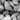
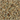

# 1 Classic

-  Birth
-  No Action
-  Slow
-  Bad Move
-  Bad Load
-  Bad Unload
-  Bad Eat
-  Collision
-  Error
-  Death

-  Hive
-  Ant

# 2 Albino

-  Birth
-  No Action
-  Slow
-  Bad Move
-  Bad Load
-  Bad Unload
-  Bad Eat
-  Collision
-  Error
-  Death

-  Hive
-  Ant
