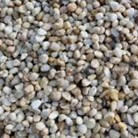
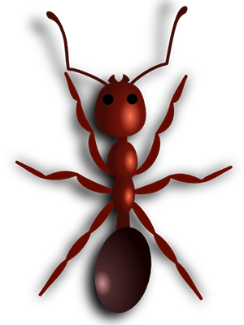
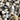
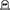
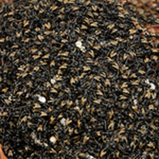
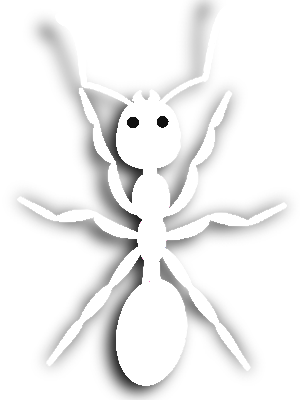

# How to add "skin/theme"
- Download sample skin pack LINK here [skin pack 0.zip](./0.zip)
- Place your art to the transparent placeholder in the pack. *Do not change dimensions or names of the files.*
- Submit PR
- Assign it to @kezlya

## 1 Fire Ant

- In Game  
- Events: 

## 2 Albino Ant

- In Game  
- Events: 

